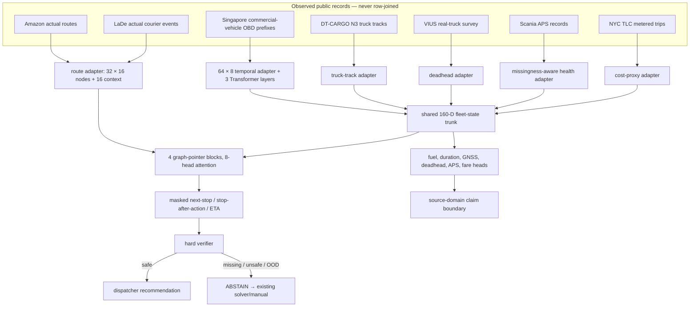
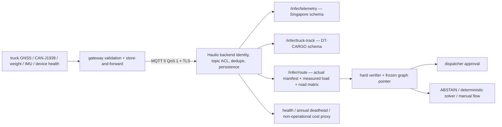

# RealBackhaulNet — Haulio autonomous backhaul AI

This repository ships a **from-scratch neural graph policy trained only on
traceable real public observations**. It replaces the earlier generated-data
demo. No pretrained checkpoint, synthetic feature row, or fake cross-source
trip participates in training, validation, or the reported result.

The accurate product claim is narrower than the challenge vision:

> Real-public-data-trained, cross-domain backhaul-policy prototype with static
> inference, hard safety constraints, reason-coded abstention, and mandatory
> dispatcher approval.

There is no public dataset in which Haulio truck IoT, measured cargo, open
orders, dispatcher choice, executed route, and realized margin are aligned for
the same decision. The model shares parameters across source-specific tasks;
it never joins unrelated rows into an event that did not happen.

## Verified release

| Property | Frozen release |
|---|---|
| Architecture | `RealBackhaulNet`, graph pointer + temporal Transformer + source adapters |
| Trainable parameters | 3,407,060 |
| Initialization | random; no pretrained weights |
| A100 train/export/evaluation run | 1,100 completed minibatches, batch 192, 40 min 33 s total wall time |
| Frozen artifact | `real_policy/submission/artifacts/real_backhaul_policy_frozen.pt` |
| Artifact SHA-256 | `11cb3412afc970a6c8c2a26a8d7f0a07ba2da6ff16c8c6c54d1b8375acd1a1f5` |
| Synthetic rows | none |
| Cross-source row joins | none |
| Runtime updates/auto-tuning/feedback | none |
| Automatic dispatch | none |

Representative deadline-bounded final held-out results (up to 4,608 immutable
rows per source; exact counts are in `metrics.json`):

| Source | Metric | Result |
|---|---|---:|
| Amazon | Next-stop top-1 | 0.6934 |
| LaDe | Next-task top-1 | 0.4364 |
| Singapore | Fuel MAE (canonical) | 0.4342 |
| Singapore | Future-idle AP | 0.4919 |
| DT-CARGO | Signal-loss MAE (canonical) | 0.3391 |
| VIUS | Deadhead MAE (canonical) | 0.1728 |
| Scania APS | Failure AP | 0.7474 |
| NYC TLC | Fare MAE (canonical) | 0.0606 |

Regression metrics labelled `canonical` are MAE in the documented transformed
source space, not Haulio business KPIs. Metrics are in
`real_policy/evidence/metrics.json`; exact split sizes and hashes are in
`real_policy/evidence/data_manifest.json`. Final partitions were opened only
after validation selected and froze the checkpoint; the metrics ledger records
the deterministic per-source evaluation cap.

## Full model architecture



The editable redraw is in
[Figma/FigJam](https://www.figma.com/board/3hAmTGtBxIFa0zhAcEsWpn?utm_source=other&utm_content=edit_in_figjam&architecture=true).
The tensor-level training and deployment diagrams are in
[`docs/ARCHITECTURE.md`](docs/ARCHITECTURE.md).

This is not A* with a neural scalar attached. The pointer jointly scores the
currently feasible candidate set and is rolled out autoregressively. A* or an
existing VRP solver remains the safe fallback. Actual mass, cube, precedence,
compatibility, windows, road availability, route budget, data freshness, GNSS,
fuel reserve, domain-shift threshold, and manifest consistency remain hard
facts that the learned model cannot override.

Amazon and LaDe route scores are conditional on the published next action
being present in the target-independent nearest-32 candidate set. The manifest
records eligible/capped rows and Amazon exclusions; this release does not
mislabel masked-index checks as empirical validation of truck constraints.

## Exact real datasets

Raw third-party files are not committed. Immutable provider identifiers,
URLs, rights, expected bytes, and locked hashes are in
[`data_sources/registry.yaml`](data_sources/registry.yaml) and
[`data_sources/checksums.lock`](data_sources/checksums.lock). The committed run
manifest records the hashes of the exact raw files and processed tensors.

| Source | Observed unit and role | Processed train / validation / final | Honest boundary |
|---|---|---|---|
| Amazon Last Mile 2021 | actual route sequence, parcel cube, windows, volumetric capacity | 60,000 / 10,000 / 10,000 | U.S. last-mile vans; no IoT or measured kg |
| LaDe | actual accepted/completed courier tasks, location, event intervals | 60,000 / 10,000 / 10,000 | courier analogue; no truck capacity/fuel |
| Singapore commercial vehicles | first-half real speed/engine/grade/load/MAF/acceleration prefixes | 1,831 / 126 / 465 | 10 vehicles; full-trip fuel is publisher-calculated; no reliable cargo-load label |
| DT-CARGO | real class-N3 truck track, speed, HDOP, mass ratings | 71,120 / 14,370 / 16,336 | cargo and coordinates withheld |
| VIUS 2021 | real truck configuration and annual mile-use survey | 17,340 / 4,073 / 3,335 | annual deadhead prior, not a live empty-return label |
| Scania APS | 170 real anonymous truck fields plus missing bits | 51,085 / 8,915 / 16,000 | APS-specific; no vehicle/time IDs |
| NYC TLC Jan 2024 | real chronological passenger trips and metered fare | 100,000 / 20,000 / 20,000 | code-path proxy, never Indonesian freight price/margin |

Amazon's locked objects contain 6,112 build routes and 3,052 matching official
evaluation routes (9,164 total), versus 3,072/9,184 described by the publication;
the repository reports the files it actually hashed. LaDe's merged five-city
files contain 472,419 delivery and 531,115 pickup records. The lightweight
DT-CARGO files contain 101,826 tracks and 53 observed vehicle IDs; the paper
describes 54 trucks. These discrepancies are preserved, not silently changed.

The Deliveree website is not used: no licensed open bulk training feed was
verified. Athens pharmaceutical orders and planned-versus-driven routes are
real external audits only; CFS, ROAD, Olist, and OSM remain documented
candidates and do not enter this checkpoint.

## IoT relevance and source isolation



Singapore and DT-CARGO have separate inference schemas. A DT-CARGO track is
never inserted into a Singapore trip, and neither is attached to an Amazon or
LaDe route. Cargo weight is not guessed: `/infer/route` requires the current
measured/manifest kg and cm3 values. MQTT authentication, replay ordering, and
QoS-1 deduplication stay in the upstream Haulio backend.

## Reproduce the real-data run

Review each source's terms before acquisition. Amazon and LaDe require explicit
acknowledgement flags:

```bash
./data_sources/download_real_data.sh --list
ACCEPT_AMAZON_CC_BY_NC_4_0=1 \
ACCEPT_LADE_RESEARCH_TERMS=1 \
  ./data_sources/download_real_data.sh core

python real_policy/data/prepare_real.py \
  --raw data_sources/raw \
  --output data_sources/processed

python real_policy/data/audit_real.py \
  --raw data_sources/raw \
  --processed data_sources/processed \
  --report real_policy/evidence/real_data_audit.json

REAL_DATA_ROOT="$PWD/data_sources/processed" \
MAX_HOURS=0.18 STEPS=3000 BATCH_SIZE=192 \
  ./real_policy/run_a100.sh
```

The trainer refuses non-A100 hardware, a budget above 9.5 hours, a missing
source, or a manifest that does not explicitly declare real-only,
source-isolated preprocessing. Candidate neighbourhoods are chosen before the
target is checked. The Singapore temporal input uses only the first half of a
trip and excludes the publisher instantaneous-fuel stream integrated into the
fuel target.

## Competition runtime

The preliminary-round container contains static core inference only:

```bash
cd real_policy/submission
docker compose up --build -d
curl --fail http://127.0.0.1:8088/health
```

| Endpoint | Learned output | Boundary |
|---|---|---|
| `POST /infer/route` | autoregressive next-stop route, stop-after-action auxiliary, LaDe ETA | actual route facts required; early stop is ignored while jobs remain |
| `POST /infer/telemetry` | full-trip fuel/duration and future-idle probability from a first-half prefix | Singapore source domain; load prediction disabled |
| `POST /infer/truck-track` | duration, signal loss, home-base/long-haul probability | DT-CARGO N3 source domain |
| `POST /infer/health` | APS failure probability | Scania source domain |
| `POST /infer/deadhead` | annual deadhead/reposition/loaded fractions | VIUS annual prior only |
| `POST /infer/price` | ordered metered-fare proxy quantiles | NYC TLC proxy; `operational_quote=false` |

The service binds to loopback, verifies the model hash before readiness, runs
unprivileged on a read-only filesystem, and contains no optimizer, backward
pass, auto-tuning, bulk-test endpoint, feedback store, checkpoint reload, model
promotion, or dispatch side effect. Example payloads are transformed or raw
held-out public observations with explicit provenance; no Haulio-shaped event
is fabricated.

## Validation

```bash
python -m unittest discover -s real_policy/tests -v
python -m compileall -q real_policy
bash -n data_sources/download_real_data.sh real_policy/run_a100.sh
docker compose -f real_policy/submission/docker-compose.yml config
```

The executed notebook independently reloads final Amazon and LaDe tensors,
checks the frozen SHA, replays inference, verifies finite outputs and hard-mask
selection, and fails if the manifests claim synthetic data, row joins, mutable
weights, or final-before-freeze evaluation.

## Deliverables

- [`real_policy/submission/`](real_policy/submission/) — competition core inference and frozen artifact
- [`notebooks/real_policy_training_evaluation.ipynb`](notebooks/real_policy_training_evaluation.ipynb) — executed real-data evidence notebook
- [`docs/haulio-real-backhaul-policy-ieee.pdf`](docs/haulio-real-backhaul-policy-ieee.pdf) — IEEE-style paper; only the compiled PDF is committed
- [`docs/REAL_DATA_CARD.md`](docs/REAL_DATA_CARD.md) — data, hashes, rights, leakage controls, and claim limits
- [`docs/EDGE_CASE_MATRIX.md`](docs/EDGE_CASE_MATRIX.md) — VRP/IoT edge cases, required facts, architecture handling, and fallback
- [`docs/LITERATURE_GAPS.md`](docs/LITERATURE_GAPS.md) — paper-by-paper gap review, including CluPDTSP/CAADRL
- [`docs/COMPETITION_COMPLIANCE.md`](docs/COMPETITION_COMPLIANCE.md) — static-inference compliance map

The release does not claim field safety, causal empty-kilometre reduction,
Haulio SLA/margin uplift, live empty-return calibration, or Indonesian
truckload pricing. Those outcomes require a frozen chronological Haulio shadow
dataset and a dispatcher-controlled pilot; this repository does not simulate
that evidence.
