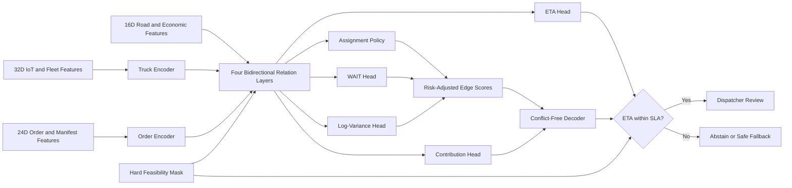

# Autonomous Backhaul Optimizer — Data Science

[IEEE Paper](docs/haulio-backhaul-graph-policy-ieee.pdf) ·
[Executed Notebook](notebooks/frozen_policy_demo.executed.ipynb) ·
[Model Card](learned_policy/submission/MODEL_CARD.md) ·
[Frozen Runtime](learned_policy/submission/) ·
[Editable Figma Architecture](https://www.figma.com/board/ryVmyI10KFaUtrQytUhxNU)

This repository now has an actual learned core: a 4,393,161-parameter
constraint-conditioned heterogeneous graph policy trained from random
initialization on one A100 and frozen as TorchScript. It jointly ranks feasible
truck–order assignments from current IoT, fleet, order, and road context. A
deterministic compiler and verifier retain authority over non-negotiable safety
constraints, and every recommendation requires dispatcher approval.

The existing `app/` implementation remains the operational baseline and safe
fallback for the map demo, multi-hop enumeration, anomaly rules, price/margin
calculation, and route-deviation workflow. Those heuristics are useful, but they
are not relabelled as AI. The checkpoint itself solves bounded one-step
assignment for at most 16 trucks and 32 orders; it is not a universal VRP or
multi-stop route constructor.

## What is learned—and what is not

| Challenge capability | Current implementation | Evidence boundary |
| --- | --- | --- |
| Cargo–truck matching | **Learned** heterogeneous graph policy plus hard feasibility mask | Fixed-seed synthetic snapshots |
| ETA and contribution | Learned auxiliary heads plus deterministic SLA/cost checks | Not field-calibrated |
| WAIT decision | Learned truck-level action | Same synthetic generator family |
| Empty-return risk | Explainable operational heuristic in `app/` | Not learned by this checkpoint |
| Route and multi-hop optimization | OSRM road geometry plus deterministic one/two-load enumeration in `app/` | No learned tour construction |
| Abnormal data/journey detection | HMAC, sequence, range, GPS-quality, IoT-health, and corridor rules | Deterministic safety logic |
| Price and margin | Transparent operating-cost baseline; contribution head is advisory | No calibrated market-price claim |

This is an offline multi-task policy learner, **not reinforcement learning**:
training combines conflict-free teacher imitation, utility and ETA regression,
and a differentiable expected-reward/collision surrogate. No Deliveree,
OpenStreetMap, DT-CARGO, or proprietary Haulio records entered the reported
training run; all training and validation snapshots came from the included
Indonesia-style synthetic generator.

## End-to-end architecture

```mermaid
flowchart LR
    subgraph Truck["Truck IoT"]
        Sensors["GNSS, CAN/J1939, IMU, Weight, Device Health"]
        Gateway["Validation, Timestamping, Offline Buffer"]
        Sensors --> Gateway
    end

    subgraph Platform["Haulio Platform"]
        MQTT["MQTT 5, TLS, QoS 1"]
        Nest["NestJS Device Authentication"]
        State[("PostgreSQL Telemetry and Fleet State")]
        Snapshot["Corridor Snapshot and Hard Constraints"]
        Gateway --> MQTT --> Nest --> State --> Snapshot
    end

    Context["Orders, Manifests, OSM Roads, Weather"] --> Snapshot

    subgraph AI["Frozen Graph Policy"]
        Graph["Typed Truck-Order Graph"]
        GNN["Four Heterogeneous Relation Layers"]
        Heads["Policy, Value, ETA, Risk, WAIT Heads"]
        Decoder["Conflict-Free Decoder and SLA Verifier"]
        Graph --> GNN --> Heads --> Decoder
    end

    Artifact[("Frozen TorchScript and Static Manifest")] -.-> GNN
    Snapshot --> Graph

    subgraph Control["Human-Controlled Outcome"]
        Review["Dispatcher Review"]
        Accept{"Accept recommendation?"}
        Commit["Existing Haulio Workflow"]
        Fallback["WAIT or Static Safe Fallback"]
        Review --> Accept
        Accept -->|"Yes"| Commit
        Accept -->|"No"| Fallback
    end

    Decoder --> Review
```



There is deliberately no path from dispatcher decisions back to model weights.
The editable FigJam also contains a second diagram of the internal learned
model and deterministic safety envelope.

## Frozen model core



## A100 training evidence

| Evidence | Result |
| --- | ---: |
| Parameters | 4,393,161 |
| Hardware | NVIDIA A100-SXM4-80GB |
| Optimization | AdamW, BF16, 6,000 steps |
| Best checkpoint | Step 4,000 |
| Wall time | 360.4 seconds |
| Standard slice | 2,560 snapshots; 1.7768 vs 1.6661 baseline (+0.1107, +6.64%) |
| Sensor-dropout slice | 960 snapshots; 0.7381 vs 0.6764 baseline (+0.0617, +9.13%) |
| Decoded violations / duplicates | 0 / 0 across 3,520 snapshots |
| Frozen parity | 0.0 on export batch; independent audit max `7.629e-06` |
| Artifact SHA-256 | `c33c4a83ac3a6925cc9634ecf6d29fb929427918ed70440cf8560beb3527b733` |

Reward is simulator-defined and unitless. Zero decoded violations follow from
deterministic masks and the conflict-free decoder; they do not prove safety in
traffic. The reported 0.1309 ms standard latency is batched A100 model-forward
P95 per snapshot, not HTTP or CPU end-to-end latency. These results are not
evidence of real-world Haulio uplift.

## Run frozen inference

```bash
cd learned_policy/submission
docker compose up --build
curl http://127.0.0.1:8088/health
curl -sS http://127.0.0.1:8088/infer \
  -H 'Content-Type: application/json' \
  --data-binary @demo_input.json
```

The Compose service binds only to loopback, uses a read-only root filesystem,
loads the artifact only after SHA-256 verification, and exposes `/health` and
`/infer`. Its directory contains no optimizer, trainer, automatic update,
auto-tuning, bulk runner, model-promotion path, or feedback loop.

To reproduce the offline A100 experiment outside the preliminary runtime:

```bash
cd learned_policy
MAX_HOURS=4 STEPS=6000 BATCH_SIZE=256 ./run_a100.sh
```

Training code and evidence are development provenance only. The static
`learned_policy/submission/` directory is the competition demonstration
boundary. The IEEE paper was authored in LaTeX/TikZ, but only the compiled PDF
is versioned as requested.

## Run the operational fallback demo

Python 3.11+ is sufficient; no `pip install` is required.

```bash
cd compfest-aic-2026-ds
cp .env.example .env # only if you do not already have .env
python3 run.py
```

Open [http://127.0.0.1:8080](http://127.0.0.1:8080). The server deliberately binds to loopback by default, so the unauthenticated MVP cannot be reached from the network.

For the current split, map-first interface, launch the DS API, Nest gateway,
and Next.js client in separate terminals:

```bash
cd ../haulio-be
docker compose up -d postgres
npm ci
npm run start:dev

cd ../compfest-aic-2026-fe
npm run dev -- --hostname 127.0.0.1
```

Open [http://127.0.0.1:3000](http://127.0.0.1:3000). Next.js proxies
`/api/v1/*` to the loopback Nest gateway on port 3001, which forwards the
allowlisted operations contract to this loopback API on port 8080. This
directory remains the model/data-science source of truth. The client never receives
`GOOGLE_MAP_API`.

Run the checks with:

```bash
python3 -m unittest discover -s tests -v
```

Seed a richer, clearly synthetic Indonesia operations history for the demo map
and audit metrics:

```bash
python3 scripts/seed_demo_db.py
```

The seed is idempotent and writes only labelled synthetic historical telemetry
to the ignored local SQLite database.

Fetch a separate cache of current public weather at the 38 provincial operating
centres when you want ETA to include environmental context:

```bash
python3 scripts/pull_context_data.py
```

This makes one batched Open-Meteo request and writes `data/context/`, which is
ignored by Git. It contains weather only; the digital-twin fleet, cargo and
telematics remain explicitly synthetic until real devices are connected.

## Environment

The existing server-side Maps key is read from `GOOGLE_MAP_API`.

```dotenv
GOOGLE_MAP_API=your-ip-restricted-server-key
IOT_SHARED_SECRET=replace-with-a-long-random-secret
HOST=127.0.0.1
PORT=8080
OSRM_BASE_URL=https://router.project-osrm.org
REGION_GEOJSON_URL=https://raw.githubusercontent.com/AlfianAliM/Indonesia-GeoJSON/master/provinsi.geojson
```

In Google Cloud, enable **Routes API** and restrict the server key to the public outbound IP that Google sees. The application invokes it only when a dispatcher selects **Check live traffic**. The key never leaves the server, is ignored by Git, and is never returned by an endpoint.

For a future browser-rendered Google map, create a separate `Maps JavaScript API` key restricted by website referrer; do not reuse this server key in the browser.

## What the MVP does

| Capability | Implementation |
| --- | --- |
| Empty-return risk | Explainable probability from expected empty location, nearby compatible open cargo, next-job approval, fuel flexibility, and vehicle type. |
| ETA | P50/P90 operating baseline from remaining job time, road distance, road class assumptions, GPS accuracy, and an optional cached public-weather delay factor. Google can give a current traffic confirmation on demand. |
| Cargo–vehicle matching | Hard capacity/vehicle-type/pickup-window checks before profit-and-confidence ranking. |
| Multi-hop backhaul | Enumerates compatible one- and two-load plans; keeps only plans that meet all time windows and margin floors. |
| Data/journey anomaly | HMAC device signature, monotonic sequence, geographic bounds, GPS quality, unusual speed, and route-corridor checks. |
| Price and margin | Transparent fuel, driver, maintenance, and stop-cost calculation; exposes minimum viable quote and expected margin. |

### Route deviation policy

The product does not punish a driver just for taking another road.

1. A dispatcher accepts a recommendation before it becomes an active plan.
2. Verified GPS is measured against a route **corridor**, not an exact polyline.
3. A modest deviation with sufficient pickup-window slack is labelled `valid_reroute`.
4. A larger deviation becomes `replan_required`, which should re-rank cargo and alert a dispatcher.
5. Invalid signatures, impossible speeds, or low GPS accuracy are independent data-quality signals.

## API

| Method | Endpoint | Purpose |
| --- | --- | --- |
| `GET` | `/api/v1/health` | Readiness and traffic-adapter status. |
| `GET` | `/api/v1/metrics` | Dispatcher metrics and audit totals. |
| `GET` | `/api/v1/fleet` | Fleet state, risk, ETA, and anomaly status. |
| `GET` | `/api/v1/orders` | Open/assigned cargo orders. |
| `GET` | `/api/v1/regions` | All 38 province geometries, coloured by current truck and accepted telemetry-log activity. |
| `GET` | `/api/v1/recommendations` | Ranked direct and multi-hop plans. |
| `GET` | `/api/v1/recommendations/:id/route-options` | Up to three road-following OSRM alternatives, gray alternative geometry, ETA bands, and local GPS traffic bands. |
| `POST` | `/api/v1/recommendations/:id/decision` | Dispatcher body: `{ "action": "accept" | "reject", "note": "optional" }`. |
| `GET` | `/api/v1/recommendations/:id/live-traffic` | One-time Google Routes API confirmation; `Cache-Control: no-store`. |
| `POST` | `/api/v1/telemetry` | HMAC-signed device event. |
| `POST` | `/api/v1/simulation/tick` | Produce signed digital-twin telemetry for every vehicle. |

### Telemetry contract

```json
{
  "device_id": "gw-cirebon-04",
  "truck_id": "TRK-04",
  "timestamp": "2026-08-23T12:00:00Z",
  "lat": -6.231,
  "lon": 106.967,
  "speed_kph": 54,
  "heading": 89,
  "gps_accuracy_m": 9,
  "cargo_status": "loaded",
  "fuel_pct": 68,
  "cargo_weight_kg": 7800,
  "can": {"coolant_temp_c": 88},
  "imu": {"accel_x_g": 0.12, "gyro_z_dps": 1.8},
  "health": {"power_v": 12.4, "signal_dbm": -81, "uptime_s": 14400},
  "sequence": 1,
  "signature": "hex-hmac-sha256"
}
```

The signature is `HMAC-SHA256` of canonical JSON—sorted compact JSON of all fields except `signature`—using `IOT_SHARED_SECRET`. The simulator follows exactly this contract. The DS layer accepts late, correctly signed events as `replayed: true` to support an IoT gateway's offline store-and-forward buffer; it still rejects future timestamps and non-monotonic sequences.

In the deployed architecture devices do **not** call this endpoint from the public internet. They publish MQTT QoS 1 to `haulio/v1/telemetry/{device_id}`. The NestJS gateway authorizes its device-to-truck mapping, persists the raw event and latest state in PostgreSQL, then forwards this signed payload to the loopback DS endpoint. `DS_IOT_SHARED_SECRET` on the gateway must be the same server-to-server secret as this service's `IOT_SHARED_SECRET`; device-specific secrets stay only in the gateway mapping.

## Production next steps

1. Replace the synthetic marketplace with immutable manifest/order events, scans, and dispatcher decisions.
2. Download an OpenStreetMap Indonesia/Java extract and run OSRM/GraphHopper for production road-network matrices; the public OSRM address in `.env.example` is a hackathon fallback, not a production dependency.
3. Use the NestJS authenticated MQTT adapter with one device credential per tracker, TLS/mTLS, topic ACLs, credential rotation, and a server-to-server DS secret; do not expose the DS telemetry route to devices.
4. Add dispatcher SSO/RBAC, rate limits, PostgreSQL/PostGIS, encrypted secret management, and production observability before exposing the service.
5. Train/calibrate models only from consented historical fleet data under time-based validation; report P50/P90 ETA calibration, precision/recall for empty-return risk, and achieved-versus-predicted margin.
