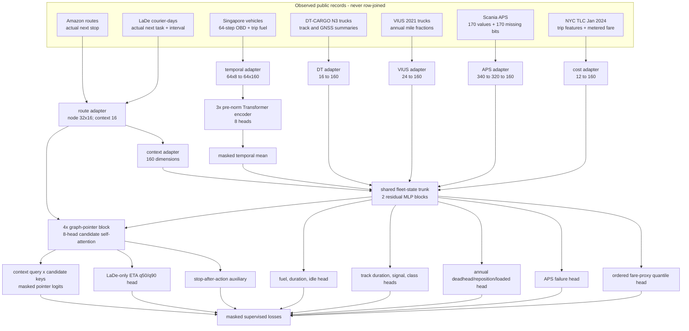
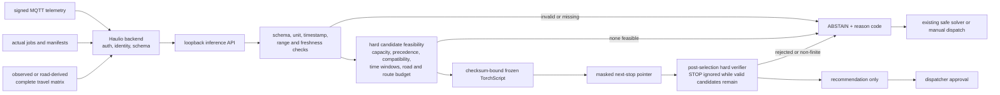

# RealBackhaulNet architecture

The shipped network is trained from random initialization. Public records stay
inside their source domain: a Singapore trip is never attached to an Amazon
route, a VIUS truck is never assigned to a LaDe task, and a TLC fare is never
presented as a freight quote. Cross-domain transfer occurs only through shared
parameters.

The editable architecture board is available in
[Figma/FigJam](https://www.figma.com/board/3hAmTGtBxIFa0zhAcEsWpn?utm_source=other&utm_content=edit_in_figjam&architecture=true).

## Training graph

The network uses a 160-wide latent state, four graph blocks, three temporal
Transformer layers, eight attention heads, and at most 32 active route
candidates. The route decoder scores the candidate set jointly rather than
predicting a scalar edge cost for A*. It is rolled out autoregressively during
inference.

Cross-family coupling occurs through the shared trunk; Amazon and LaDe also
instantiate the same route adapter, graph blocks, pointer, ETA, and stop
modules. Only LaDe minibatches supervise the ETA head; Amazon ETA targets are
absent and masked out. A minibatch activates one source and only labels that
exist there. Missing labels are represented by `NaN` and excluded from the
loss; missing input values use frozen train-split robust statistics plus
explicit missing bits. STOP is an auxiliary output, but the deployment decoder
ignores it whenever at least one valid candidate remains.

## Deployment graph

The competition container has static parameters. It exposes only health and
core inference endpoints; there is no optimizer, training endpoint, model
reload, auto-tuning, bulk tester, feedback store, or automatic dispatch action.

## Outputs and evidence boundary

| Head | Output | Held-out evidence | Deployment interpretation |
|---|---|---|---|
| Route pointer | next-stop logits, stop-after-action auxiliary, ETA q50/q90 | Amazon and LaDe sequence labels; ETA from LaDe only, capped at 72 h | ranking metrics include only steps whose actual next node is inside the independently selected candidate set; the hard verifier remains authoritative |
| Commercial telemetry | full-trip fuel/duration and future idle-heavy probability from a first-half prefix | vehicle-disjoint Singapore trips | source-domain IoT forecast; no cargo-load prediction |
| Heavy-truck track | duration, signal loss, home/long-haul probabilities | vehicle-disjoint DT-CARGO tracks through an independent endpoint | N3 truck/GNSS auxiliary output; never joined to Singapore payloads |
| Deadhead | annual deadhead, repositioning, loaded fractions | state-disjoint VIUS trucks | annual survey prior, not a live empty-return label |
| Health | APS failure probability | official Scania test | APS-specific source-domain health classification |
| Cost proxy | ordered p10/p50/p90 | chronologically held-out TLC trips | NYC passenger fare proxy, never an Indonesian freight quote |

No public source contains the aligned Haulio tuple of live telemetry, measured
cargo weight, open jobs, dispatcher choice, executed route, and realized
profit. Consequently this release reports component-level held-out metrics and
does not claim causal Haulio savings or field safety.

Final metric values are single point estimates on deterministic capped held-out
subsets (at most 24 batches or 4,608 rows per source); the release does not
provide confidence intervals or probability-calibration evidence. Authoritative
full-split counts live in the processed manifest and integrity-audit report;
the metrics ledger records exact evaluated counts. The integrity audit checks hashes, tensor contracts,
manifest invariants, and split-group isolation, but it does not independently
rederive features, targets, or candidate neighbourhoods from raw records. The
reported `hard_constraint_violations` value checks whether a selected index was
masked; it is not an independent feasibility proof for the runtime constraints.
