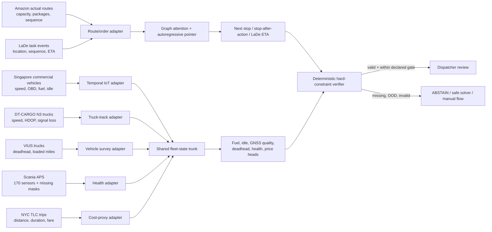

# RealBackhaulNet

This directory contains the from-scratch, real-public-data replacement for the
old simulator-trained policy. No synthetic record participates in training,
checkpoint selection, or reported evaluation. The raw datasets
are not committed; their immutable URLs, rights, checksums, observed fields,
and exact evidence boundaries are recorded in `../data_sources/`.

## What the model is

`RealBackhaulNet` is one multi-domain neural policy with a learned graph-pointer
route decoder and real-IoT auxiliary encoders. Each minibatch comes from one
source and activates only the labels that source actually observes. The shared
state trunk learns across tasks, but unrelated records are never attached to
one another:



This is not A* with a learned scalar bolted on. The learned pointer policy
jointly scores all currently feasible stops and is called autoregressively to
construct a route. Hard capacity, manifest, vehicle-type, pickup-before-drop,
time-window, reserve-fuel, and duplicate-service rules remain deterministic
inside the DS boundary. Device authentication and topic authorization remain
deterministic in the upstream Haulio backend. A learned recommendation cannot
bypass the verifier or commit a dispatch; dispatcher acceptance is mandatory.
STOP is an auxiliary output and is ignored whenever at least one valid
candidate remains.

## What the data can prove

The artifact is a **real-public-data-trained, cross-domain prototype**. It has
component-level held-out evidence for route behavior, courier ETA, commercial
vehicle fuel/idle state, heavy-truck GNSS quality/duration, annual truck
deadhead, truck APS failure, and a metered trip-cost proxy.

There is no public dataset containing the aligned Haulio tuple of live truck
telemetry, actual cargo weight, contemporaneous open jobs, dispatcher/tender
decision, executed route, and realized revenue/cost. The code therefore never
manufactures that tuple. It does not claim Haulio uplift, Indonesian truckload
price calibration, causal empty-kilometre reduction, or field safety.

Only LaDe supervises the route ETA head; Amazon supplies route sequence labels
but no ETA target. Route metrics are conditional on actual-next-node coverage
inside the independently selected nearest-32 candidate set. The reported
`hard_constraint_violations` value is a masked-index consistency check, not
evidence that public rows exercised or independently proved Haulio's runtime
capacity, legal, time-window, or road verifier. Final metrics are point
estimates on deterministic capped held-out subsets (at most 24 batches or
4,608 rows per source), without confidence intervals or
probability-calibration evidence.

## Reproduce acquisition, preparation, and training

Review source terms first, then use the idempotent acquisition script:

```bash
./data_sources/download_real_data.sh --list
ACCEPT_AMAZON_CC_BY_NC_4_0=1 ACCEPT_LADE_RESEARCH_TERMS=1 \
  ./data_sources/download_real_data.sh core
python real_policy/data/prepare_real.py \
  --raw data_sources/raw \
  --output data_sources/processed
python real_policy/data/audit_real.py \
  --raw data_sources/raw \
  --processed data_sources/processed \
  --report real_policy/evidence/real_data_audit.json
REAL_DATA_ROOT="$PWD/data_sources/processed" \
  MAX_HOURS=9.25 STEPS=8000 BATCH_SIZE=192 \
  ./real_policy/run_a100.sh
```

The trainer rejects a budget above 9.5 hours; the wrapper also applies a
9-hour-30-minute process timeout. It requires an NVIDIA A100, initializes every
parameter randomly, and refuses a processed manifest unless it explicitly
declares `contains_synthetic=false`. Official Amazon evaluation data are not
opened until the best validation checkpoint has been selected and frozen.
Exact final split counts are recorded in the processed manifest and audit
report, not the metrics file. The audit checks hashes, tensor contracts,
manifest invariants, and split-group isolation; it does not independently
rederive transformations, labels, or candidate neighbourhoods from raw data.

## Competition runtime

Only `submission/` is required for the demonstration. It contains static core
inference, the frozen artifact, its manifest and evidence, and a
loopback-only Compose service. It contains no optimizer, backward pass,
auto-tuning, bulk testing, update endpoint, model promotion, or feedback loop.

```bash
cd real_policy/submission
docker compose up --build
curl http://127.0.0.1:8088/health
```

Each task endpoint accepts a real record from its own schema. The demonstration
fixtures are transformed held-out public observations with source IDs and raw
artifact hashes; they are not synthetic Haulio events and are never joined
across sources.
